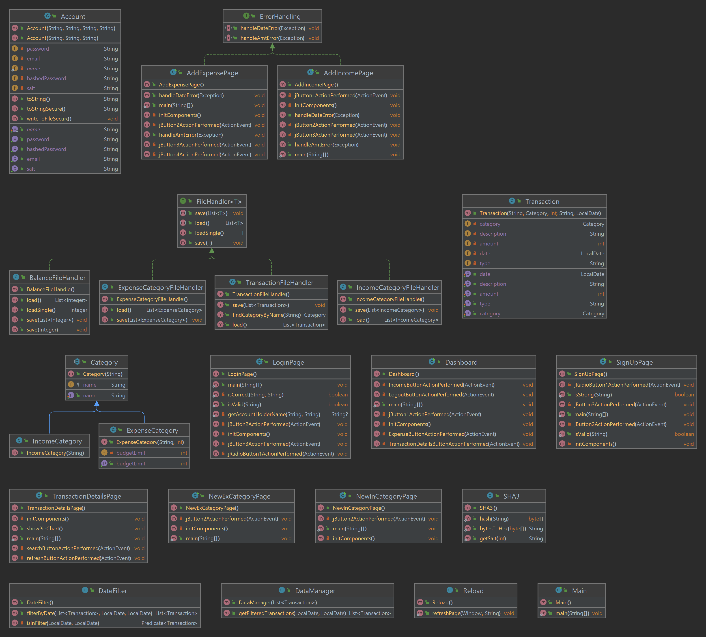

# BudgetBuddy 💰

BudgetBuddy is a user-friendly expense tracker system developed as a final project for Object-Oriented Programming (OOP). 

Priscilla Abigail Munthe - 2602109883

### Features

- Create an account
- View existing transactions and current balance
- Add income and expense transactions
- Add new income and expense categories
- View detailed transactions
- View visualization of expenses using PieChart

### UML Class Diagram

